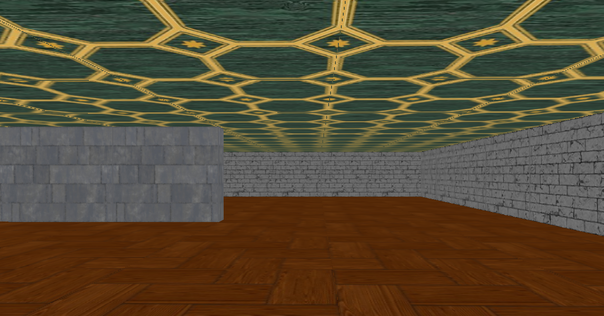

# UltimateRaycastingEngine
Un moteur 3D de raycasting style Wolfenstein. Le code source n'est pas documenté pour le moment, mais lisible sous VisualStudio 2022. Il est compilable facilement sous Windows depuis VisualStudio 2022 en prenant soin d'inclure les librairies **GLEW 64bit, GLFW 64bit, GLM 64bit, opengl32.lib** en version dynamique de préférence pour GLEW et GLFW.

